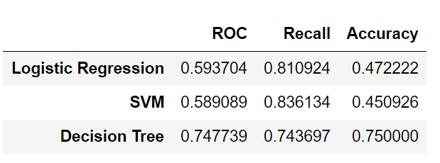

# Customer-Churn

## Business Value

Customer churn is a major problem and one of the most important concerns for companies due to the direct effect on the revenues. Therefore it is important to develop means to predict potential customer to churn. Hence finding factors that increase customer churn is important to take necessary actions to reduce this churn. 

## Problem Statement

To predict customer churn based on various variables like customer account information and customer activity.

## Data

Each row of data represents a customer and each column contains's a customer's attributes.

__Customers who left/churned__ : _Exited_ 

__Demographic Information of customers__ : _Geography_ , _Gender_ , _Age_ 

__Customer Account Information__ :_Tenure , HasCrCard , Balance , IsActiveMember , EstimatedSalary , NumOfProducts , CreditScore_ 

## Approach

+ Loading Data

+ Data Exploration

+ Spliting Data for Train, test and Validation

+ Data Visualization
    - Univariate
    - Bivariate
    
+  Finding Missing Values

+ Label Encoding 

+ One Hot Encoding of Categorical Values
+ Feature Scaling and Normalization

+ Feature Selection

+ Training Model

	- Logistic Regression
	- SVM 
	- Decision Tree

In order to measure the performance of the model, the Area Under Curve (AUC) standard measure, and Accuracy is adopted 

## Visualizing Data

### Data Distribution

__Product Distribution__

__Salary Distribution__

__Tenure Distribution__

__Balance Distribution__

__Customer Age vs Customer Churn__

__Account Balance vs Customer Churn__

__Correlation Heat Map of All Features__

## Feature Selection

__Selected Features__

## Model Building and Training

1. ### __Logistic Regression__

__Training Data__

__Validating Data__

2. ### __SVM Model__

__Training Data__

__Validating Data__

3. ### __Decision Tree Model__

__Training Data__

__Validating Data__

__Comparing All Clasifiers__

From the Model Comparison we see that Decision Tree Model has better Area Under curve and Accuracy over the other two models.

## __Conclusion__
The precision of the model on previously unseen test data is slightly higher with regard to predicting 1's i.e. those customers that churn. However, in as much as the model has a high accuracy, it still misses some of those who end up churning. The model could be improved by providing and retraining the model with more data over time. :-)
